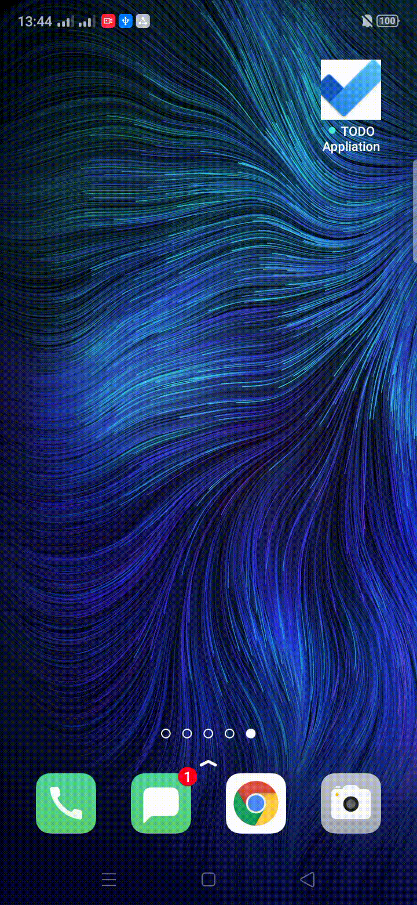
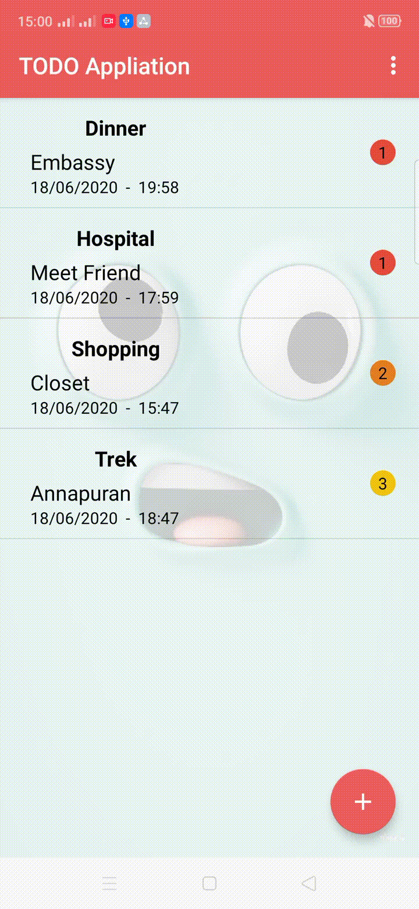
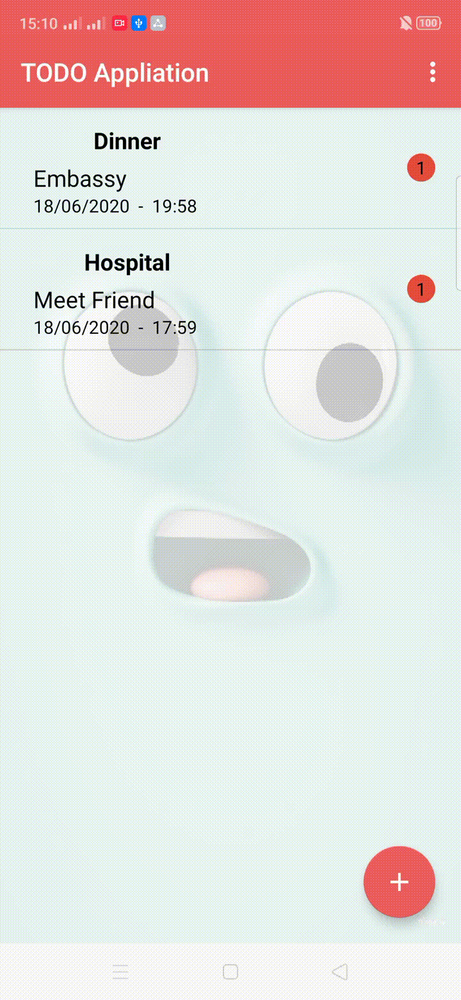

# Developing Mobile Application 2020
<b>Module Leader: BINAY SHAH</b> 
<b>By: DEVESH MANANDHAR</b>

## ToDo Application
- This application is simple example of ToDo list app with many requirement and extra features provided by university guideline. 
- This application based on JAVA using ROOM And MVVM. The code provided by module leader was used.
- Entities, Fragments, Toast, Dialogue, NavigationView, Splash Screen. 
## Changing App Logo

## Demo of Splash Screen

## Adding task and List of Tasks
   - Use of toast
   - Date Picker
   - Drag task to Arrange
    
   
    
## Deleting and Rearranging Task Using OnSwipe Method</b>
   - Display Toast Message after swipe delete
   - Task can be rearranged by long pressing the task and dragging.
   

## Drawer Navigation
   - Use of Drawer NavigationView
     

## Menu COnsisting of 
   - I used menu to show other features shown below
    
   #### Sign In
   - I was unable to join login with database. This Function works but is Incomplete.
   

        
   ### Register
   - User can be member of the app.
   

    
   ### List Of Members

    
   ### Link For Git Repo
   - I have linked my Git Repo in this app.

    
   ### Use Of Fragments 
   

## Use of Dialouge box

